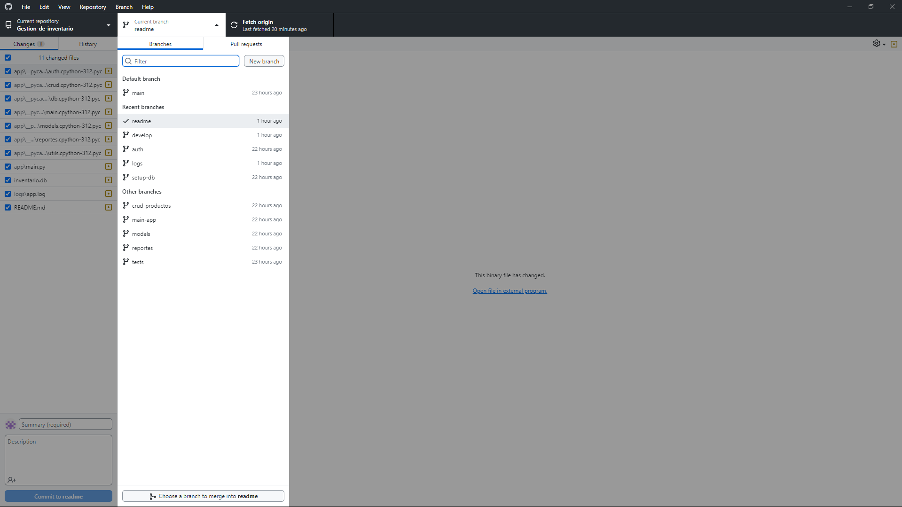
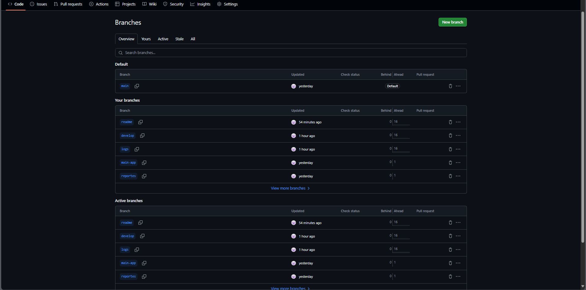
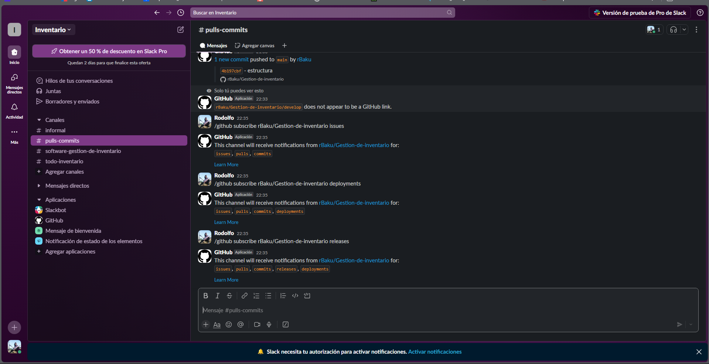

# Gestión de Inventario
autor: Rodolfo Osorio V.
rol: 201973014-2
Para probar el programa se debe usar el comando python -m app.main en la terminal. 
---

## Tecnologías Utilizadas

- Python 3.10+
- SQLite3

---

## Funcionalidades

### ✔️ CRUD de Productos
- Agregar, editar, consultar y eliminar productos

### ✔️ Gestión de Stock
- Registro de ventas y nuevas unidades

### ✔️ Filtrado y Búsqueda
- Buscar productos por nombre o categoría

### ✔️ Reportes
- Total de productos, valor total del inventario, productos agotados

### ✔️ Autenticación
- Login con nombre de usuario y contraseña (encriptadas)

### ✔️ Logs
- Registro de operaciones y errores en `logs/app.log`

---

## ¿Cómo especificar mejor el requerimiento?
1. **Dividir el requerimiento en módulos funcionales claros**:
   - **Módulo de Productos (CRUD)**
   - **Módulo de Stock (Entradas/Salidas)**
   - **Módulo de Autenticación**
   - **Módulo de Reportes**
   - **Módulo de Búsqueda y Filtrado**

2. **Agregar criterios de aceptación por módulo**:
   - “El sistema debe permitir al usuario agregar un producto con los siguientes campos: nombre, descripción, cantidad, precio unitario y categoría.”
   - “El sistema debe evitar cantidades negativas en el inventario.”
   - “El usuario no podrá acceder a ninguna funcionalidad sin autenticarse.”
---
## ¿Cómo asegurar que el programa cumpla el requerimiento?

1. **Revisión del código con manejo de excepciones y logs**:
   - Validar que todos los posibles errores (inputs inválidos, falta de conexión, etc.) estén capturados con `try-except` y registrados en `app.log`.

2. **Verificación final** con checklist:
   - ¿Se puede ingresar, consultar, modificar y eliminar productos?
   - ¿Se protege el acceso con autenticación?
   - ¿Se generan los reportes correctos?
   - ¿El sistema responde correctamente a entradas inválidas?
---
## Organización, explicar cómo se organizó el proyecto y el flujo de trabajo de éste.
- El proyecto fue estructurado en una arquitectura modular, dividiendo cada funcionalidad en archivos separados para facilitar el mantenimiento, reutilización de código y escalabilidad.

Se utilizó un enfoque **Gitflow simplificado** para gestionar el desarrollo:

1. **Branch Principal (`main`)**:
   - Contiene la versión estable del proyecto.
2. **Branch de Desarrollo (`dev`)**:
   - Se implementaron nuevas funcionalidades, pruebas y validaciones.
3. **Branches por Módulo**:
   - Cada funcionalidad importante se trabajó en una rama separada (por ejemplo, `feature/auth`, `feature/reportes`).

---

### Flujo de Desarrollo

1. **Inicio**:
   - Análisis de requerimientos y planificación de módulos.
2. **Implementación por fases**:
   - CRUD de productos
   - Gestión de stock
   - Autenticación
   - Reportes
   - Validaciones y manejo de errores
   - Logging
3. **Integración**:
   - Reunión de módulos y pruebas de integración.
4. **Documentación**:
   - Se elaboró el `README.md`, registros de pruebas y se configuró el archivo `app.log`.
5. **Entrega**:
   - Versión final consolidada en `main`.

---
## evidencia de flujo de trabajo y configuraciones realizadas

---
## Problemas encontrados y como se solucionaron.

1. Cantidades negativas  
**Problema**: Se podían ingresar cantidades o precios negativos.  
**Solución**: Se agregaron validaciones para evitar valores negativos en productos y stock.

2. Acceso no autorizado  
**Problema**: Cualquier usuario podía usar la app.  
**Solución**: Se implementó autenticación por usuario y contraseña.

3. Falta de trazabilidad  
**Problema**: No se registraban errores ni operaciones.  
**Solución**: Se incorporó un sistema de logs (`app.log`) para registrar eventos y fallos.

4. Código desorganizado  
**Problema**: Todo estaba en un solo archivo.  
**Solución**: Se modularizó el proyecto separando funcionalidades por archivo.
---

